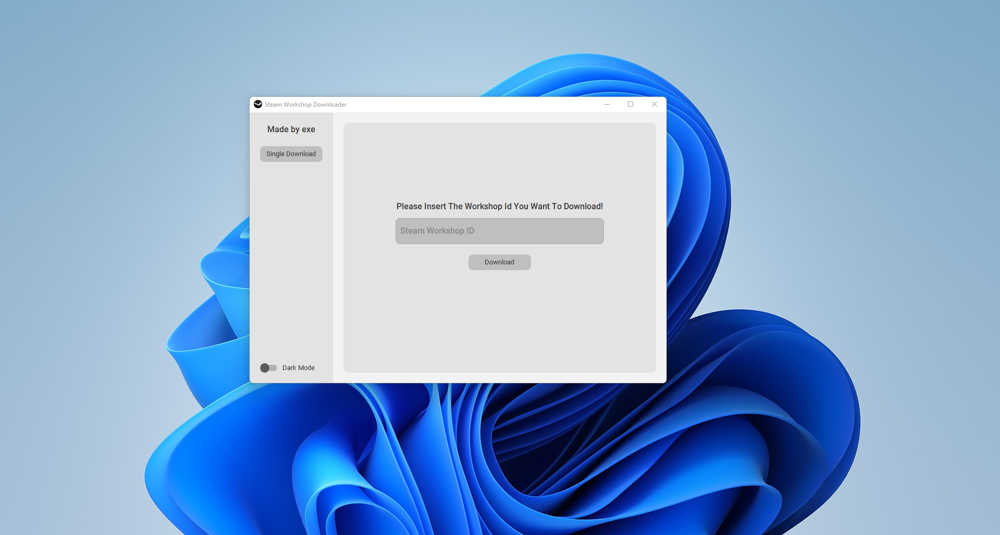

# Gmod-Steam-Workshop-Downloader

fast and reliable workshop downloader for gmod. 



# Installation

```
1-) install python on your computer
```

```
2-) copy the files to your computer
```

```
3-) run pip install -r requirements.txt on the directory of your copy in cmd
```

```
4-) change the api key and output dir strings in sw_downloader.py 
```

```
5-) run python sw_downloader.py on the directory of your copy in cmd 
```
